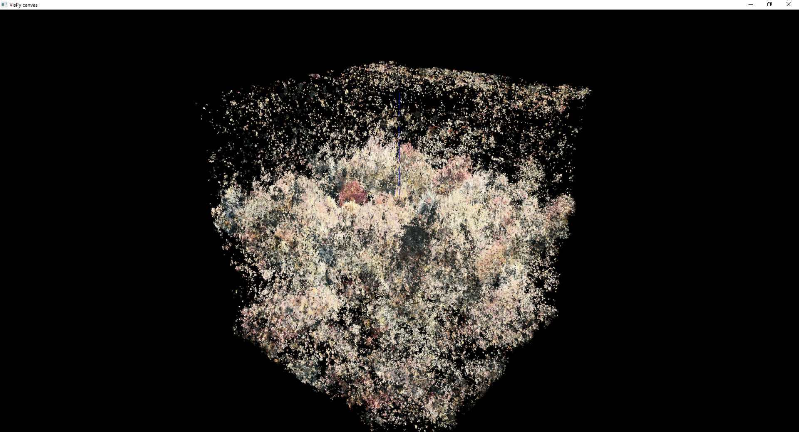
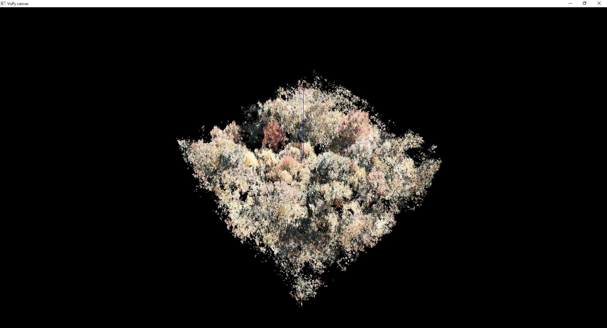
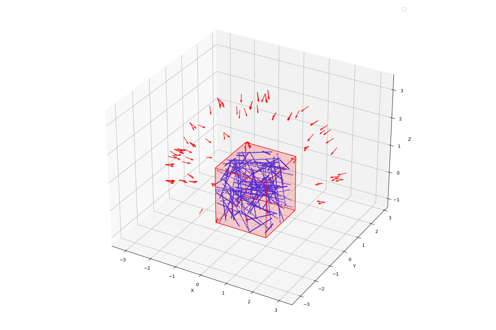
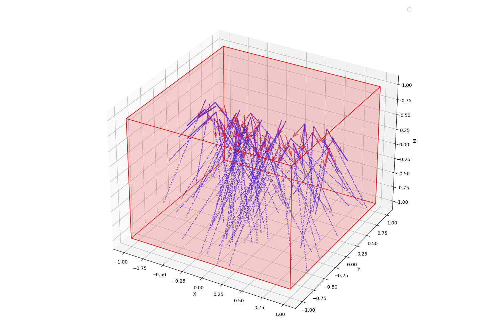

# NeRF – 3D Volume Reconstruction

A pipeline for neural radiance field (NeRF) based 3D volume reconstruction.

---
### Python Environment Setup (Python 3.11)

**1. Create a Virtual Environment**
```bash
python -m venv .venv
```
**2. Activate the Virtual Environment**
```bash 
# Windows
.venv\Scripts\activate
# On macOS/Linux
source .venv/bin/activate
```

**3.  Install Project Dependencies**
```bash
pip install -r requirements.txt
```
**4. Install [Pytorch](https://pytorch.org/get-started/locally/) and [tiny-cuda-nn](https://github.com/NVlabs/tiny-cuda-nn) for [Instant-NGP](https://github.com/NVlabs/instant-ngp)**

**4.1  Install PyTorch (CUDA 12.6)**
```bash
pip3 install torch torchvision --index-url https://download.pytorch.org/whl/cu126
```
**4.2 Install [tiny-cuda-nn](https://github.com/NVlabs/tiny-cuda-nn)**
```bash
git clone --recursive https://github.com/nvlabs/tiny-cuda-nn
cd tiny-cuda-nn\bindings\torch
# Install via setup script
tiny-cuda-nn/bindings/torch$ python setup.py install
```
 Make sure torch is installed before building tiny-cuda-nn, and your system has a compatible CUDA toolkit (e.g., 12.6).

**5. Install [Colmap](https://github.com/colmap/colmap)**
Download and install COLMAP for structure-from-motion and multi-view stereo reconstruction: 
[COLMAP Releases (Windows/Linux/macOS)](https://github.com/colmap/colmap/releases)

---

**Project Directory Structure**

```text
project_root/
├── data/                           # Contains raw input images and colmap outputs.
│   └── scene_name
│       ├── images/                 # Resized input images (used for training).
│       ├── images_original/        # Original high-resolution input images.
│       └── colmap_text_original/   # COLMAP sparse reconstruction (in text format).
│
├── configs/                        # YAML configuration files for each scene.
│   ├── blender_scene.yml           # Config file for the blender scene.  
│   ├── dataS7.yml                  # Config file for the DataS7 scene.  
│   ├── real_scene.yml              # Config file for the Subset scene.  
│   └── <scene_name>.yml            # Config file for the corresponding scene.
│
├── outputs/                        # Outputs from training or extraction.
│   └── <scene_name>
│       ├── checkpoints/            # Saved model checkpoints.
│       └── logs                    # TensorBoard logs.
│
├── scripts/    
│   ├── instantngp.py               # Instant-NGP variant of NeRF.
│   ├── vanilla_nerf.py             # Standard NeRF implementation.
│   ├── resize_images.py            # Resizes input images to desired resolution.
│   ├── dataset.py                  # Dataset class for NeRF data loading.
│   ├── normalize_with_aabb.py      # Normalizes scene and write the transforms_<scene_name>.json.
│   ├── precompute_rays.py          # Precomputes ray directions as <scene_name>_ray_data.npz.
│   ├── sampling.py                 # Sampler class for stratified/hierarchical sampling.
│   ├── train.py                    # Training script for NeRF.
│   ├── extract_vol.py              # Extracts colored occupancy volume from trained model.
│   ├── write_format.py             # Writes the tiff and vti format for napari and paraview.
│   └── post_process_vol.py         # Postprocess and clean the volume.
│
├── outputs/                        # Created output files from from training.
│   └── <scene_name>/               # Outputs related to the specific scene.
│       ├── checkpoints/            # Trained model checkpoints.
│       └── logs/                   # TensorBoard logs for training visualization.
│
└── README.md                        # Project documentation
```


### Running the Pipeline.

1. Resize the images:
```bash
python scripts\resize_images.py --cfg_path cfg\<scene_name>.yml
```
The resized images will be saved in the ``data/<scene_name>/images`` folder specified in your config file.

1. Run COLMAP on the resized images and export the scene in text format inside the image directory, in a folder named ```colmap_text```.

```bash
python .\scripts\run_colmap.py --workspace .\data\<scene_name>\
```


3. Create the transform.json file
```bash
python scripts\normalize_with_aabb.py --cfg_path cfg\<scene_name>.yml
```
**Rotation Matrix Initialization**
Each scene allows you to define a custom rotation matrix.
Press the R key in the VisPy viewer to print the current rotation matrix in YAML format. This makes it easy to copy and paste into your configuration file (e.g., rotation_initial: in a .yml file).

**Manual AABB Adjustment**
The Axis-Aligned Bounding Box (AABB) can be manually specified in your config file to override the default normalization. This is useful for cropping, focusing on a subregion, or fine-tuning reconstruction bounds.

```python
# transform.json
# python scripts\normalize_with_aabb.py
rotation: True
rotation_initial: #null
  - [0.77892503, -0.25715966, 0.57196565]
  - [-0.62710305, -0.32549969, 0.70766639]
  - [0.00419140, -0.90990047, -0.41480546]

#compute_percentile_bbox(points, lower=1.0, upper=99.8, padding=0.17)
percentile_bbox:
  lower: 1.0
  upper: 99.8
  padding: 0.17

rot_order: [0, 1, 2] # apply order rotation
# axis order x, y, z - alpha, beta, gamma
angles: [75, 0, 0] # alpha, beta, gamma
shift: [-0.1, -0.2, -0.3]
visualize: True

# aabb
aabb_adjust:
  aabb_min: [0, 0, 0.85]
  aabb_max: [0, 0, 0.1]

```
<p align="center">
  
</p>


4. Precompute the camera rays for the entire dataset and save them to a file for faster training or evaluation ```<scene_name>_ray_data.npz ```
```bash
python scripts\precompute_rays.py --cfg_path cfg\<scene_name>.yml
```

5. Train the nerf model
```bash
python scripts\train.py --cfg_path cfg\<scene_name>.yml  
```
After training, the NeRF model will be saved to:
```outputs\<scene_name>\checkpoints\nerf_final.pth```

6. Extract volume with the pretrained network
```bash
python python scripts\extract_vol.py --cfg_path cfg\<scene_name>.yml
```
The volume wil be saved to: ```outputs\<scene_name>\volume.pth```

7. Postprocess/clean the volume
Since we sample density values across the entire 3D volume of the cube, we clean the volume via slicing the it using the axis-aligned bounding box (AABB).
```bash
python scripts\post_process_vol.py --cfg_path cfg\<scene_name>.yml --visualize sliced
```

<p align="center">
  <table>
    <tr>
      <td align="center">
        <br>
        <sub><b>Before Slicing</b></sub>
      </td>
      <td align="center">
        <br>
        <sub><b>After Slicing</b></sub>
      </td>
    </tr>
  </table>
</p>

8. Create the volume format for Paraview

```bash
python scripts\write_format.py --cfg_path cfg\<scene_name>.yml
```
This script will generate the following output folders: ```napari```, ```paraview```, ```vti``` in the ```output\<scene_name>``` directory. Each folder will contain the binary and RGB volume representations in their respective file formats (.tif, tiff, .vti), ready for visualization in tools like Napari or ParaView.

<p align="center">
  
</p>


---

### Outlier Filtering and Scene Normalization

**1. Filter Statistical Outliers**

To clean the 3D point cloud before normalization, we remove statistical outliers using Open3D. Each point is compared to its neighbors, and those too far from the local mean are discarded.
```python
def filter_statistical_outliers(points, nb_neighbors=20, std_ratio=2.0):
    """
    Remove statistical outliers from a point cloud using Open3D.

    Args:
        points (np.ndarray): Input point cloud as an (N, 3) array.
        nb_neighbors (int): Number of neighbors to consider for each point.
        std_ratio (float): Standard deviation threshold for filtering.

    Returns:
        filtered_points (np.ndarray): Cleaned point cloud.
        ind (list of int): Indices of inlier points.
    """
    pcd = o3d.geometry.PointCloud()
    pcd.points = o3d.utility.Vector3dVector(points)
    pcd, ind = pcd.remove_statistical_outlier(
        nb_neighbors=nb_neighbors, std_ratio=std_ratio
    )
    filtered_points = np.asarray(pcd.points)
    return filtered_points, ind
```


Next, we normalize the filtered points so they lie within the cube $[-1, 1]^3$. Instead of using min/max directly (which is sensitive to noise), we compute the bounding box using percentiles (e.g., 1st and 97th). This gives a more robust estimate of scene bounds. We then compute the center and a uniform scale factor to center and scale the scene. A small padding is applied to avoid placing points exactly on the cube boundary.

Let:
* $x_i \in R^3$ be a 3D point from COLMAP.
* $mins,maxs\in R^3$ be the per-axis lower and upper percentiles 
  (e.g., 1st and 97th).
* $c \in R^3$ be the center of the bounding box.
* $s \in R$ be a uniform scale factor.


$$
\begin{aligned}
\mathbf{c} & = \frac{\mathbf{mins} + \mathbf{maxs}}{2} \\
s &= \frac{2(1 - \text{padding})}{\max(\mathbf{maxs} - \mathbf{mins})} \\
\mathbf{x}_{\text{norm}} &= s \cdot (\mathbf{x}- \mathbf{c})
\end{aligned}
$$

This ensures that all normalized points $x_{norm,i}$ lie within the cube:
$$
[-1 + \text{padding},\ 1 - \text{padding}]^3
$$


```python
def compute_percentile_bbox(points, lower=1.0, upper=97.0, padding=0.2):
    """
    Compute a robust bounding box using percentiles, and return
    the center and scaling factor for normalization.

    Args:
        points (np.ndarray): Input point cloud (N, 3).
        lower (float): Lower percentile (default: 1.0).
        upper (float): Upper percentile (default: 97.0).
        padding (float): Padding ratio (0 to 1) inside the unit cube.

    Returns:
        center (np.ndarray): Center of the bounding box.
        scale (float): Uniform scaling factor.
    """
    mins = np.percentile(points, lower, axis=0)
    maxs = np.percentile(points, upper, axis=0)
    center = (mins + maxs) / 2.0
    scene_size = np.max(maxs - mins)
    scale = (2.0 * (1.0 - padding)) / scene_size
    return center, float(scale)
```


The vanilla NeRF is using the OpenGL coordinate system and colmap uses the OpenCV coordinate system. Thus we have to flip the y and z axsis.
**Orientation of the Coordinate system:**

| Frame           | +X     | +Y        | +Z            | Description                      |
| --------------- | ----- | -------- | ------------ | -------------------------------- |
| COLMAP/OpenCV      | right | down | forward  | +X right, +Y down, +Z into scene |
| NeRF/OpenGL | right | up   | backward | +X right, +Y up, -Z into scene   |

<p align="center">
  
</p>


**Proper similarity transformation:** $T_{4x4}'​=F_{\text{flip}} \cdot T_{4x4} \cdot F_{\text{flip}}^⊤$
```python
# Correct method:
flip = np.diag([1, -1, -1])
flip_4x4 = np.eye(4)
flip_4x4[:3, :3] = flip
T_new = flip_4x4 @ T @ flip_4x4.T
```

Since the conventional pinhole camera model assumes the OpenCV coordinate system, we map image pixels into the camera coordinate system by applying the inverse of the intrinsic matrix to the homogeneous pixel coordinates:
$$
K = \begin{bmatrix}
f_x & 0 & c_x \\
0 & f_y & c_y \\
0 & 0 & 1
\end{bmatrix}
$$
$$
\mathbf{x}_{\text{cam}} = K^{-1} \begin{bmatrix} u \\ v \\ 1 \end{bmatrix}
$$

If the resulting 3D point is to be used in the OpenGL coordinate system, we apply an additional axis flip to convert from OpenCV to OpenGL coordinates:
$$
F = \begin{bmatrix}
1 & 0 & 0 \\
0 & -1 & 0 \\
0 & 0 & -1
\end{bmatrix}
$$
$$
\mathbf{x}_{\text{gl}} = F \cdot K^{-1} \begin{bmatrix} u \\ v \\ 1 \end{bmatrix}
$$

Source:
[Pose convention](https://github.com/nex-mpi/nex-code/wiki/Pose-convention)
[Colmap - Section images.txt](https://colmap.github.io/format.html)
[NerStudio](https://docs.nerf.studio/quickstart/data_conventions.html)
[Instant ngp](https://github.com/Vincentqyw/instant-ngp/blob/d13cd1a81b658fd9d3b694ee17ddb741102e7580/scripts/render.py#L40-L106)
[Coordinates and Transformations](https://motion.cs.illinois.edu/RoboticSystems/CoordinateTransformations.html)

---

### Train data format

The dataset expects `.npz` files with the following structure:

```python
# Required fields
ray_origins: [N, 3]      # Ray origins in world space
ray_directions: [N, 3]   # Normalized ray directions
rgb: [N, 3]              # Target normalized RGB values [0, 1]
```

### Ray-Cube Intersection using the Slab Method

We apply a ray-box intersection technique to determine whether a ray intersects the normalized scene bounding box `[-1, 1]^3`, and if so, to compute the **entry** (`t_near`) and **exit** (`t_far`) points along the ray.

### Purpose

For volumetric rendering in NeRF, we only want to sample 3D points along rays **within** the scene’s bounding volume. This step:
- **Filters out rays** that do not intersect the scene box.
- Computes **ray intervals** (`t_near`, `t_far`) to define where to sample along the ray.
- Reduces compute and memory usage during training.

---

## Mathematical Background: The Slab Method

The **slab method** is an efficient way to compute the intersection of a ray with an axis-aligned bounding box (AABB). The idea is to compute the range of `t` values where the ray is inside each axis-aligned slab (for X, Y, and Z), and then compute the intersection of these intervals.

### Ray Equation

A ray can be written as:

\[
\mathbf{r}(t) = \mathbf{o} + t \cdot \mathbf{d}
\]

Where:
- \( \mathbf{o} \in \mathbb{R}^3 \) is the ray origin
- \( \mathbf{d} \in \mathbb{R}^3 \) is the (normalized) ray direction
- \( t \in \mathbb{R} \) is the distance along the ray

---

### Intersection Computation

For each axis \( i \in \{x, y, z\} \), we compute the intersection points with the box planes:

\[
t_{min}^i = \frac{cube_{min} - o_i}{d_i}, \quad t_{max}^i = \frac{cube_{max} - o_i}{d_i}
\]

We then **ensure proper ordering**:

\[
t_{entry}^i = \min(t_{min}^i, t_{max}^i), \quad
t_{exit}^i = \max(t_{min}^i, t_{max}^i)
\]

We combine across all axes:

\[
t_{near} = \max(t_{entry}^x, t_{entry}^y, t_{entry}^z) \\
t_{far} = \min(t_{exit}^x, t_{exit}^y, t_{exit}^z)
\]

If \( t_{near} \leq t_{far} \) and \( t_{far} \geq 0 \), the ray intersects the box.

```python
def ray_cube_intersection_numpy(
    ray_origins, ray_directions, cube_min=-1.0, cube_max=1.0
):
    """
    Compute ray-cube intersection using NumPy.

    Args:
        ray_origins: Array of shape [N, 3] - ray origins in world space
        ray_directions: Array of shape [N, 3] - ray directions in world space (should be normalized)
        cube_min: Minimum coordinate of the cube (default: -1.0)
        cube_max: Maximum coordinate of the cube (default: 1.0)

    Returns:
        intersects: Boolean array of shape [N] - True if ray intersects cube
        t_near: Array of shape [N] - near intersection parameter (entry point)
        t_far: Array of shape [N] - far intersection parameter (exit point)
    """
    # Ensure inputs are numpy arrays
    ray_origins = np.asarray(ray_origins, dtype=np.float32)
    ray_directions = np.asarray(ray_directions, dtype=np.float32)

    # Handle near-zero direction components to avoid division by zero
    epsilon = 1e-8
    ray_directions = np.where(
        np.abs(ray_directions) < epsilon,
        np.sign(ray_directions) * epsilon,
        ray_directions,
    )

    # Compute intersection parameters for each axis
    # t = (cube_bound - ray_origin) / ray_direction
    t_min_x = (cube_min - ray_origins[:, 0]) / ray_directions[:, 0]
    t_max_x = (cube_max - ray_origins[:, 0]) / ray_directions[:, 0]

    t_min_y = (cube_min - ray_origins[:, 1]) / ray_directions[:, 1]
    t_max_y = (cube_max - ray_origins[:, 1]) / ray_directions[:, 1]

    t_min_z = (cube_min - ray_origins[:, 2]) / ray_directions[:, 2]
    t_max_z = (cube_max - ray_origins[:, 2]) / ray_directions[:, 2]

    # Ensure t_min <= t_max for each axis (swap if direction is negative)
    t_min_x, t_max_x = np.minimum(t_min_x, t_max_x), np.maximum(t_min_x, t_max_x)
    t_min_y, t_max_y = np.minimum(t_min_y, t_max_y), np.maximum(t_min_y, t_max_y)
    t_min_z, t_max_z = np.minimum(t_min_z, t_max_z), np.maximum(t_min_z, t_max_z)

    # Find the intersection interval
    t_near = np.maximum(np.maximum(t_min_x, t_min_y), t_min_z)
    t_far = np.minimum(np.minimum(t_max_x, t_max_y), t_max_z)

    # Ray intersects cube if t_near <= t_far and t_far >= 0
    intersects = (t_near <= t_far) & (t_far >= 0)

    # Ensure t_near is non-negative (clamp to 0 if ray starts inside cube)
    t_near = np.maximum(t_near, 0.0)

    return intersects, t_near, t_far
```

<p align="center">
  
  
</p>

Source: 
[Slap Method]("https://en.wikipedia.org/wiki/Slab_method")

---
